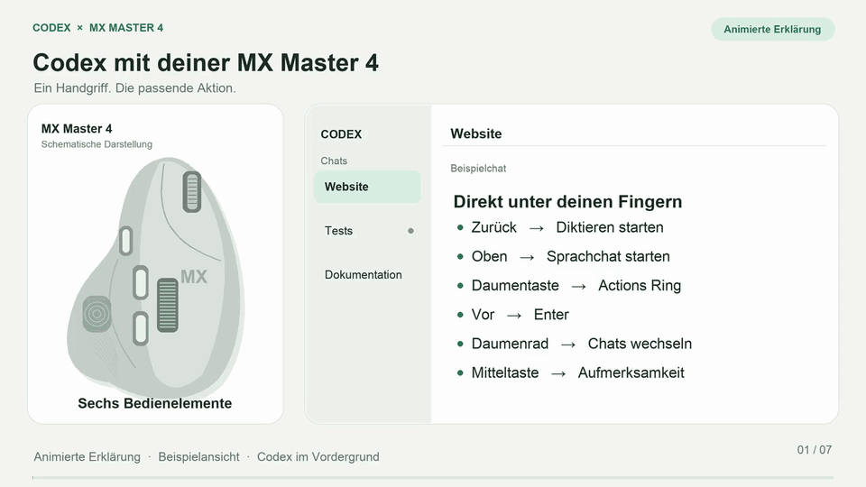

# codex-mx-master-4

Configure a Logitech MX Master 4 for the Codex desktop app on macOS in one command, with a preview, private backups and scoped restoration.

Dictate text, start a voice chat, confirm prompts, switch chats and open an eight-action ring directly from the mouse.

**Experimental v0.1.3.** Uses the locally verified Options+ and Logi Plugin Service file formats. This is a community tool, not an official Logitech or OpenAI installer. The native ring archive has been imported successfully through Options+. Installation, native persistence and a subsequent unchanged preview have been verified on a Mac. Physical mouse events and voice/dictation activation still require a user check.

[Installation guide in German](docs/installation-de.md)

## See it in 32 seconds

[](https://github.com/patrickschiller/codex-mx-master-4/releases/download/v0.1.3/codex-mx-master-4-demo.mp4)

[Download the MP4 video](https://github.com/patrickschiller/codex-mx-master-4/releases/download/v0.1.3/codex-mx-master-4-demo.mp4) · [English transcript and video details](docs/demo.md)

A 32-second animated explanation in English, without sound. The mouse and app are simplified illustrations; the demo contains no private chats or recorded hardware test.

## Install

Requirements: Python 3.9+, Options+ already set up with your MX Master 4, and the Codex desktop app. Open the Actions Ring once before running the preview. No Python packages, API key or administrator privileges are needed.

```sh
git clone https://github.com/patrickschiller/codex-mx-master-4.git
cd codex-mx-master-4
./codex-mx plan
./codex-mx install --apply --restart-logitech
```

Alternatively, download the repository ZIP, extract it, and double-click `Install.command`. macOS may require its normal permission to open a downloaded script or allow the script to quit Options+.

The installer pauses Options+ and its plugin service, backs up both settings databases, applies the Codex profile and two native Smart Actions, then reopens Options+. **Fully quit and reopen Codex after your running chats have finished** to activate newly installed ring and dictation shortcuts. Codex is never closed by this installer. A mouse-only update does not require another Codex restart when those shortcuts are already active.

Verified versions are deliberately restricted:

| Component | Version |
| --- | --- |
| Codex desktop | 26.930.31730 |
| Logi Options+ | 2.9.984725, settings schema 26 |
| Logi Plugin Service | 6.4.2.3414 |

Other versions stop before writing. Windows is not supported in this release.

## Mouse controls

These assignments apply only while Codex is the active application.

| Control | Action | Shortcut |
| --- | --- | --- |
| Forward button | Confirm / send | Enter |
| Back button | Start dictation | Ctrl+Shift+D |
| Upper thumb-side button | Start voice chat in the current chat | Ctrl+Shift+V |
| Middle button | Jump to a chat needing attention | Cmd+Option+A |
| Thumb wheel left / right | Previous / next chat | Cmd+Option+Left / Right |
| Haptic thumb pad | Open the Codex ring | Native Actions Ring |

Enter acts on the currently focused Codex control. Use it when the confirmation button or chat composer has focus. Chat navigation follows Codex's navigation order; it does not filter to running chats. The back and upper thumb-side buttons use native Smart Actions to start dictation and voice chat. Voice starts in the current chat. The underlying shortcuts toggle their actions, so pressing the button again can stop an active dictation or voice call.

The Actions Ring belongs on the haptic thumb pad, not the upper thumb-side button. Upgrading replaces the old new-chat voice sequence with the two actions above and removes its managed Smart Action. If that legacy action is still referenced outside the managed buttons, installation stops before changing anything. Repairing either current Smart Action also stops if it would change an action referenced by another application profile.

In the verified Codex build, dictation has no default key. The installer explicitly assigns `globalDictationSingleTap` to **Ctrl+Shift+D**. This is an OS-global Codex shortcut. Test it in the chat composer after restarting Codex. Setting it through Codex’s native shortcut editor also requests any necessary macOS permissions; an external file edit does not display that native setup prompt. Voice toggle **Ctrl+Shift+V** remains the app shortcut, distinct from the optional global voice shortcut.

The ring provides these eight actions:

| Action | Shortcut |
| --- | --- |
| Plan mode | Ctrl+Option+Shift+P |
| Fast mode | Ctrl+Option+Shift+F |
| Fork chat | Ctrl+Option+Shift+B |
| Increase reasoning effort | Ctrl+Option+Shift+Up |
| Decrease reasoning effort | Ctrl+Option+Shift+Down |
| Mute / unmute voice microphone | Ctrl+Option+Shift+M |
| Review | Ctrl+Shift+G |
| Needs attention | Cmd+Option+A |

The first six ring shortcuts and the explicit dictation shortcut are installed in `$CODEX_HOME/keybindings.json`, or `~/.codex/keybindings.json`. You can select a different location with `--codex-home /path`. Unrelated overrides are preserved; shortcut conflicts stop the preview. Existing overrides for these seven commands are replaced and recorded in the backup. Action availability still depends on the current Codex screen, model and voice state.

## Restore

The installer prints the private backup directory under `~/Library/Application Support/codex-mx-master-4/backups/`.

```sh
./codex-mx restore --backup '/absolute/path/printed/by/the/installer'
./codex-mx restore --backup '/absolute/path/printed/by/the/installer' --apply --restart-logitech
```

Restoration reverses the managed changes while preserving independent later edits. It recognizes the observed native omission of default values in managed button cards and Smart Actions, plus the developer-category migration and native usage counters. Counters on pre-existing restored actions are retained. Unrecognized changes to managed values still stop restoration; independent new fields are preserved. If you edited one of the managed values after installation, it stops and reports a conflict before writing. It also makes a backup of the restoration itself. Full SQLite snapshots of `settings.db` and `macros.db` are retained for manual recovery; normal restoration merges their JSON documents. Both databases are locked and checked before changes. Their separate WAL commits cannot be crash-atomic; caught failures compensate only our own committed values and preserve concurrent changes. Backups contain local settings and should stay private.

Restoration uses the same version checks. If your applications have since updated to an unverified version, automatic restoration stops too; keep the backup until that version is verified or use it for careful manual recovery.

## Manual import

`assets/Codex-MX-Master-4.lp5` is an Actions Ring profile with eight actions. Import it through the Options+ profile importer. The seven separate JSON files in `assets/Smart-Actions/` are optional native Smart Actions imports for functions including dictation, voice chat and Escape. The automatic installer merges the dictation and voice actions into `macros.db` and references them through native `MACRO_REF` cards. The remaining imports are optional. There is no action that opens a new chat before starting voice.

The six custom ring shortcuts still require the Codex keybindings. See the [format notes](docs/codex-keybindings.md) and [Logitech format notes](docs/logitech-format.md).

## Development

```sh
PYTHONPATH=src python3 -m unittest discover -s tests -v
```

Tests use synthetic settings, temporary SQLite WAL databases, and mocked process control. They cover preservation, repeated installation, malformed inputs, archive validation, concurrent changes, failed writes and restoration. They do not stop services or modify the developer's active configuration.

To support another version, verify its native schema and command registry before extending the allowlists in `macos.py`; passing unit tests alone does not establish compatibility with a new native release.

## References

- [Codex commands](https://learn.chatgpt.com/docs/reference/commands), [settings](https://learn.chatgpt.com/docs/reference/settings), [voice](https://learn.chatgpt.com/docs/features/voice), and [Codex Micro](https://learn.chatgpt.com/docs/features/codex-micro)
- [MX Master 4 setup](https://support.logi.com/hc/en-us/articles/28321445268247-Getting-Started-MX-Master-4)
- [Logitech profiles and importing](https://support.logi.com/hc/en-001/articles/25575505956119-Profiles-in-Logi-Options-MX-Creative-Console)
- [Importing Smart Actions](https://support.logi.com/hc/en-us/articles/14307853081111-How-can-I-import-my-Smart-Actions)

The mappings were inspired by the actions exposed in Codex Micro. This project contains its own code, text icons and profile assets. It does not redistribute native application binaries, extracted source code, personal settings or credentials. Logitech, MX Master and Codex are trademarks of their respective owners.

MIT license.
